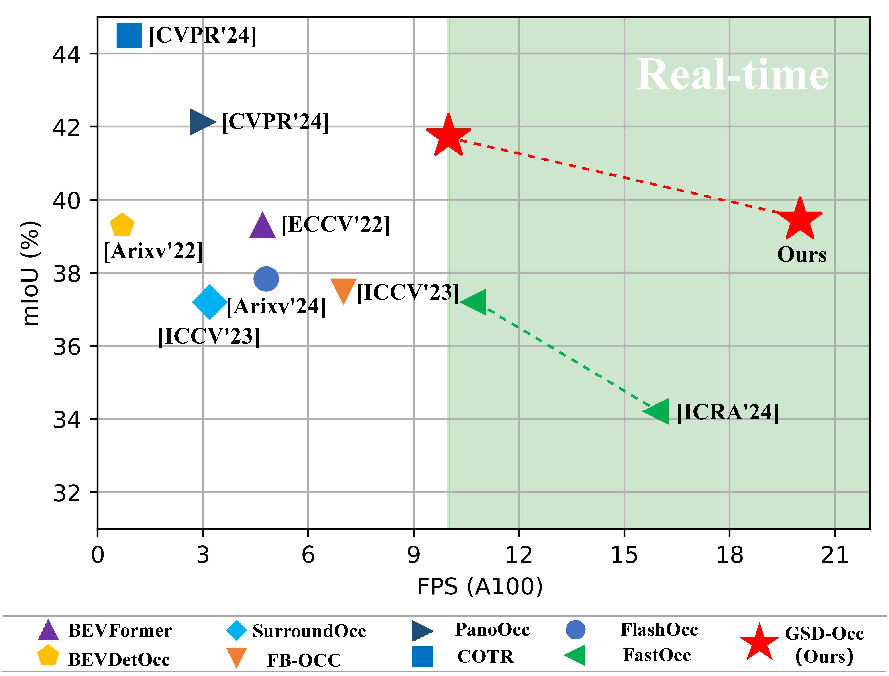

# Achieving Speed Accuracy Balance in Vision based 3D Occupancy Prediction via Geometric Semantic Disentanglement (AAAI 2025)
### Yulin He, Wei Chen, Siqi Wang, Tianci Xun, Yusong Tan


## Framework

GSD-OCC is a fast and accurate Vision-based 3D Occupancy Prediction method, which decouples the learning of geometry and semantics by model design and learning strategy two perspectives:
- For model design, we propose a dual-branch network that decouples the representation of geometry and semantics. The voxel branch utilizes a novel re-parameterized large-kernel 3D convolution to refine geometric structure efficiently, while the BEV branch employs temporal fusion and BEV encoding for efficient semantic learning.
- For learning strategy, we propose to separate geometric learning from semantic learning by the mixup of ground-truth and prediction depths.

## Performance
Extensive experiments on Occ3D-nuScenes benchmark demonstrate the superiority of our method, achieving 39.4 mIoU with 20.0 FPS.

<div align=center>   </div>

## Visualization
<div align=center>   </div>

## Getting Started
- [Installation](docs/install.md)
- [Prepare Dataset](docs/prepare_datasets.md)
- [Training, Eval, Visualization](docs/start.md)
 
## Model Zoo


* [Model weights](https://drive.google.com/file/d/1c-44e_jpu8FDF-pQApMzqaOsexgtVjF2/view?usp=sharing)

## Acknowledgments

This work builds on multiple great open-sourced code bases such as [FB-BEV](https://github.com/NVlabs/FB-BEV), [open-mmlab](https://github.com/open-mmlab), [Occ3D](https://github.com/Tsinghua-MARS-Lab/Occ3D), [COTR](https://github.com/NotACracker/COTR), [UniRepLKNet](https://github.com/AILab-CVC/UniRepLKNet), [OpenOccupancy](https://github.com/JeffWang987/OpenOccupancy), [SoloFusion](https://github.com/Divadi/SOLOFusion). Please consider citing these works as well.


## Citation
If this work is helpful for your research, please consider citing the following entry.
```
@article{he2024real,
  title={Real-Time 3D Occupancy Prediction via Geometric-Semantic Disentanglement},
  author={He, Yulin and Chen, Wei and Xun, Tianci and Tan, Yusong},
  journal={arXiv preprint arXiv:2407.13155},
  year={2024}
}
```